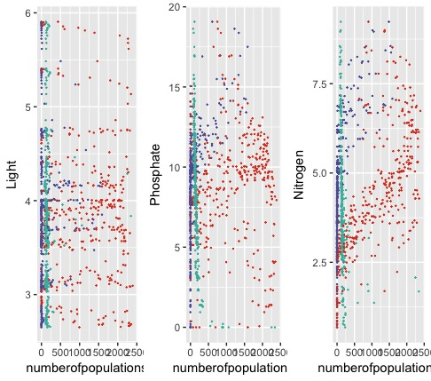
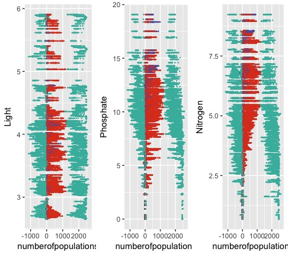

# Competitive Population Models
An N step discrete time Markov Chain. The environment is separated into n^2 slots representing the spatial and environmental resources. The simulation then runs two events, the first is a death event, which occurs with probability μ, a user input, the second is a birth event where an empty slot i is filled with members of population A with probability:

The  is a user input along with the death rate $\mu$. 

## Running the main file
Source the FunctionsWhichGenerateandPlottheModel.R file and run the modelsimulator(StartingMatrix, LikelihoodMap, NumberofTrials) function with inputs StartingMatrix an n by n matrix of the starting positions of each population, LikelihoodMap which is a list of 6 n by n matrices first 3 contain probaility of birth of an individual from populations 1 to 3 and the next three contain probability of death of an individual from populations 1 to 3. 

This saves numbered output.RDS files into your working directory. Each .RDS files contains 10 matrices, each one represents every tenth time step.

## Visualising the Simulation: Producing a GIF output
Gif extractor loads the .RDS files and saves .png files representing the model. For example output see: 

| Light   | Phosphate | Nitrogen |
| ---      | ---       | --- |
|   |           | |
|   |           | |

## Producing Migration Statistics
### Final Locations
Using the MakingLessFineMap.R gives the final location statistics on which populations are in which grids, for example: 

### Net Migration 
Using the FigureForDIfs.R produces three plots representing net migration between time steps. An example output: 

